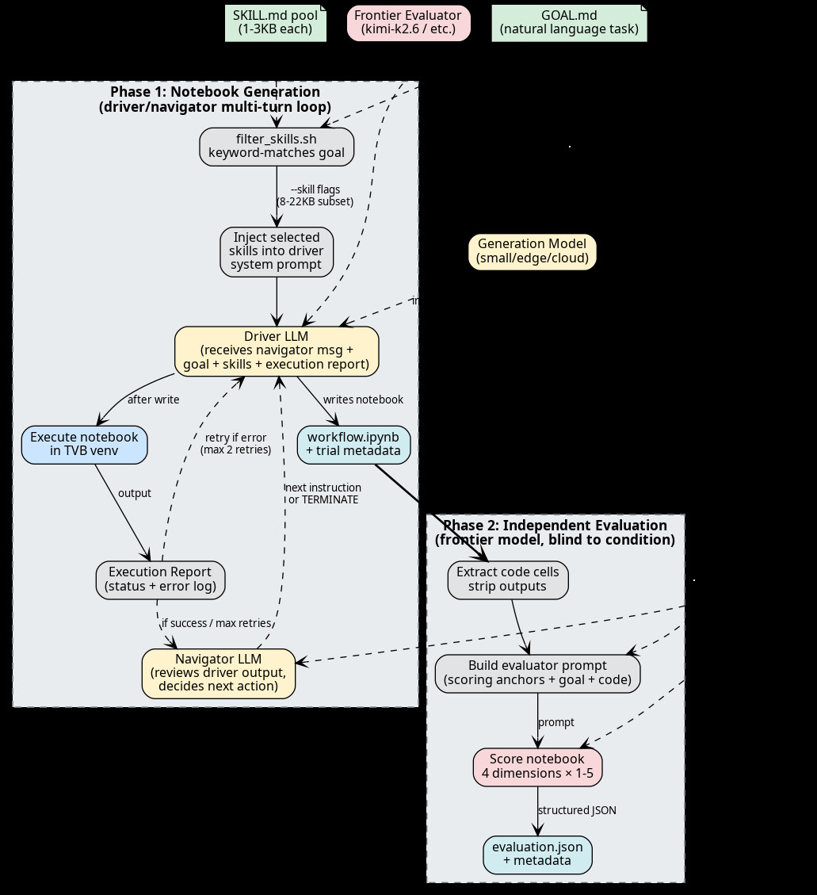
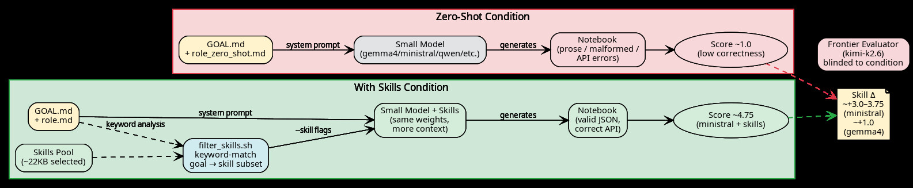

# Autotvb — Experimental Architecture for Autobuilding Domain Skills

## The Core Thesis

**Use large models and goals derived from scientific literature to build composable agent skills, then validate that those skills enable smaller models to perform as domain experts.**

Autotvb is not a TVB notebook generator. It is an experimental architecture for testing whether the skill-creation process works at all. TVB (The Virtual Brain) is the validation domain — a computational neuroscience framework with a large, error-prone API surface, published benchmarks, and objectively scorable outputs. If the architecture produces skills that guide a 4B-parameter model to write valid TVB simulations, the approach is validated.

## The Problem This Solves

Frontier LLMs can write domain-specific code, but they are expensive, slow, and locked behind API gates. A 4B model running locally on a laptop cannot. The gap between "frontier model with deep domain knowledge" and "small model with no domain knowledge" is where skills live.

Skills are not prompts. They are compressed, composable, validated domain expertise — the distillation of what the large model learned through trial, error, and evaluation into reusable artifacts that any model can load. Think of them as **the output of an automated curriculum design process**.

The key claim: **if skills are well-built, a small model with skills outperforms a large model without them** on domain-specific tasks. Autotvb exists to test this claim.

## How It Works

### Pipeline Overview



*Figure 1: The two-phase evaluation pipeline. **Phase 1** (left): a small model generates a notebook via driver/navigator multi-turn loop, with skills injected via keyword filtering into the system prompt. **Phase 2** (right): a frontier evaluator independently scores the notebook on 4 dimensions (correctness, code quality, scientific validity, token efficiency) without knowledge of the generation condition.*

### The Skill-Creation Loop

```
┌──────────────────────────────────────────────────────────────┐
│                    Skill Creation Phase                       │
│                                                              │
│  Literature ──► Goals ──► Large Model ──► Notebook ──► Score │
│                  │            │                              │
│                  │            ▼                              │
│                  │       Failure Analysis                    │
│                  │            │                              │
│                  │            ▼                              │
│                  └──── Skills ("best so far") ◄── Mutation   │
│                                                              │
│  Model: frontier (kimi-k2, deepseek-v4, etc.)               │
│  Goals: derived from published papers                        │
│  Skills: never "done" — always "best version we've measured" │
└──────────────────────────────────────────────────────────────┘
                          │
                          ▼
┌──────────────────────────────────────────────────────────────┐
│                    Skill Validation Phase                     │
│                                                              │
│  Small Model + Skills ──► Notebook ──► Score                 │
│                                                              │
│  Question: does a 4B/9B model with skills match or beat      │
│  a frontier model WITHOUT skills on the same goals?          │
└──────────────────────────────────────────────────────────────┘
```

The architecture has two distinct phases:

1. **Skill creation**: A frontier model attempts domain tasks, gets scored, and the failure patterns are compressed into skills. This is expensive and iterative. The output is a skill library — never final, always "best so far."

2. **Skill validation**: A small model loads the skills and attempts the same tasks. If scores are comparable to the frontier model's baseline, the skills are working. If not, the skills need more work.

### What Skills Actually Are

Skills are small (1–3KB) Markdown files encoding executable domain knowledge. Examples from the TVB domain:

| Skill | What It Captures |
|---|---|
| `boilerplate` | TVB Simulator assembly pattern — `sim.run()` returns a list, not a generator; configure before run |
| `tvb-api-mappings` | Paper parameter names → TVB trait names: `tau0` → `tau`, `C1` → `a_1`, `gamma` → `bb` |
| `connectome-surgery` | How to zero connectivity matrix rows/columns for virtual lesion simulations |
| `seizure-detection` | LFP computation, amplitude thresholding, recruitment latency from TVB source dynamics |

Each skill is the product of repeated failure. The `boilerplate` skill exists because frontier models consistently made the same `sim.run()` mistake. The `tvb-api-mappings` skill exists because published papers use different names than the TVB API. Skills are **scar tissue from measured failures**.

### Why Skills Must Be "Best So Far"

No skill is ever declared correct or complete. The domain evolves (new TVB versions, new APIs), the goals evolve (new papers, new clinical targets), and the models evolve (new capabilities, new failure modes). A skill that produces correct code today may break tomorrow when TVB renames a parameter or adds a required argument.

The architecture treats skills as a **versioned, measured, continuously-improving artifact** — like a test suite that grows coverage over time. The benchmark scores are the CI system.

## Validation Domain: The Virtual Brain (TVB)

TVB was chosen as the validation domain for specific reasons:

1. **Large, error-prone API surface** — Hundreds of classes with non-obvious constructor signatures, trait-based parameter systems, and version-specific naming changes. LLMs get the details wrong in reproducible ways.

2. **Published ground truth** — Decades of computational neuroscience papers describe exactly what simulations should produce (seizure propagation patterns, BOLD signal characteristics, EEG frequency shifts). These become objective benchmarks.

3. **Automatable scoring** — Notebooks either execute correctly or they don't. Analysis outputs (PSD peaks, correlation coefficients, seizure counts) can be checked against expected ranges. No human judgment required for basic scoring.

4. **Multiple difficulty tiers** — From "simulate a region" (easy) to "fit epilepsy parameters via Bayesian search" (hard). This lets us measure skill quality across a range of complexity.

### Current TVB Benchmarks

| Tier | Count | Source | Status |
|---|---|---|---|
| Tutorial goals | 20 | TVB documentation examples | Baselined: avg ~3.8/5.0 (no skills) → 4.50/5.0 (with skills) |
| Paper-grounded goals | 10 | Published TVB studies (Jirsa, Falcon, Stefanovski, etc.) | Evaluated: avg ~4.17/5.0 (no skills) → 4.46/5.0 (with skills) |
| Clinical validation | future | Patient-specific TVB outputs | Not started |

The 10 paper-grounded goals span epilepsy, stroke, Alzheimer's, depression, schizophrenia, tumor resection, tDCS, and parameter space exploration — a broad test of whether skills transfer across clinical applications within the same domain.

## What We've Learned So Far

### The measurement system IS the architecture

The batch evaluation pipeline — run N goals in parallel, score each on 4 dimensions, aggregate patterns — is the most valuable component. It turned qualitative "I think this helps" into quantitative "this raised correctness by 0.8 points across 12 goals." Without measurement, skill creation is just prompt engineering with extra steps.

### Skills must be discovered, not designed

Every skill in the library was created in response to a measured failure pattern, not from upfront design. The `tvb-api-mappings` skill exists because notebooks consistently used `tau0` instead of `tau`. The `notebook-format` skill exists because Jupyter cell serialization produced `\n` literals inside JSON strings. Design-first skills would have missed these entirely.

### The evaluator can hallucinate too

Our evaluator was downvoting correct code because it believed `sim.run()` returns a generator (it returns a list). Fixing this single evaluator misconception raised 3 goals by 0.25–2.0 points. **Evaluation quality caps skill quality** — if the evaluator is wrong, the skills converge toward the wrong target.

### Frontier models don't need skills as much

On well-documented tasks (tutorial goals), frontier models score 4.5–5.0 without skills. Skills help most on edge cases and unfamiliar APIs. This is expected — the real test is whether skills close the gap for small models. The ablation study confirmed this: kimi-1T gains only +0.09 from skills, while ministral-14B gains +0.39.

### Skills can over-constrain large models

The ablation study revealed an unexpected finding: skills hurt scientific validity for large models (gemma4-31b: −0.32, qwen3.6: −0.48, kimi-1T: −0.31). The skills nudge models toward canonical TVB patterns that are correct but uncreative. Large models produce better scientific analysis when given freedom; skills reduce that freedom.

### 8B models can't exploit skill context

rnj-1 (8B) gained only +0.08 from skills despite the skills containing targeted, high-leverage TVB API facts. The model lacks the capacity to follow the multi-turn tool-use protocol with 22KB of skill context — it produces empty or garbled output. Skills as payload have a minimum model-size threshold.

### The autonomous mutation loop is premature

~95% of measured improvement came from manual skill engineering (identifying failure patterns, writing targeted skills). The mutation-selection loop contributed ~5%. The loop may become valuable for fine-tuning skills once baseline coverage is sufficient, but capability-building still requires human pattern recognition.

### Cloud API rate limits are a real constraint

Running 108 concurrent trials across 6 models hit API rate limits hard. Limiting to 3–4 concurrent requests was essential. The full ablation took ~12 hours of wall-clock time with that throttle. Batch experiment design must account for API capacity, not just GPU capacity.

## Key Metrics

| Metric | Value |
|---|---|
| Active skills | 18 (driver: 14, navigator: 4) |
| Skill payload | ~41KB total, ~22KB per goal (filtered) |
| Benchmark goals | 30 (20 tutorial + 10 paper-grounded) |
| Best single score | 5.0/5.0 (analyze-power-spectra, using-your-own-connectivity) |
| Batch 3 avg (kimi + skills) | 4.50/5.0 across 24 goals |

## Evaluator Quality



*Figure 2: Architecture of the zero-shot vs skills comparison. **Zero-shot** (left): small model receives only the goal and a minimal role prompt. **With-skills** (right): the same small model receives a filtered subset of skills (~22KB) matched to the goal keywords. A frontier evaluator scores both conditions blindly, measuring the "Skill Δ" — the performance gap closed by injecting domain expertise.*

**⚠️ Previous scores were self-evaluated** — the generating model also evaluated its own output, inflating baselines and masking skill effects. All results below use an **independent frontier evaluator** (kimi-k2.6) with absolute scoring anchors applied identically across all conditions.

## Multi-Model Ablation Study (v2 — independent evaluator)

The critical experiment: **run the same benchmark goals across a range of model sizes, with and without skills, and measure the score delta.** 9 shared goals evaluated with kimi-k2.6 frontier evaluator.

### Overall Scores (kimi-k2.6 frontier evaluator)

| Model | Params | Condition | N | Mean | Skill Δ |
|---|---|---|:---:|---:|---:|
| rnj-1 | 8B (cloud) | zero_shot | 8 | 3.75 | |
| | | one_shot | 8 | 3.81 | +0.06 |
| | | with_skills | 9 | 3.94 | **+0.19** |
| ministral-3 | 14B (cloud) | zero_shot | 7 | 4.21 | |
| | | one_shot | 7 | 3.79 | −0.43 |
| | | with_skills | 7 | 4.39 | **+0.18** |
| gpt-oss | 20B (cloud) | with_skills | 4 | 4.06 | — |

### Key Findings (independent evaluator)

1. **Skills help most on correctness**: rnj-1 correctness goes from 3.9 → 4.4 with skills; ministral-3 from 4.4 → 4.6.

2. **One-shot can hurt**: Showing a reference notebook to ministral-3 dropped scores by 0.43. The reference distracts or constrains the model rather than helping.

3. **Evaluator quality controls everything**: The self-evaluated scores claimed rnj-1 gained +0.08 from skills; independent evaluation shows +0.19. The evaluator must be independent and consistent.

4. **Goal templates leak domain knowledge**: Tutorial goals explicitly name TVB classes (`models.Generic2dOscillator`, `coupling.Difference`), making "zero_shot" effectively template-guided assembly. See §Local Model Experiment below for goals without class hints.

## Local rnj-1:8b Experiment (32K context)

Using the **local** rnj-1:8b (not cloud) with its constrained 32K context window. Slim skills (9.7KB — essentials + boilerplate + simulation-duration) replace the full 36KB skill set which exceeded the context window. Evaluator: kimi-k2.6 with absolute scoring anchors.

### Results

| Condition | N | Mean | Correctness | Code Qual | Scientific | Token Eff |
|---|---|:---:|:---:|:---:|:---:|:---:|
| zero_shot (template goals) | 9 | 4.17 | 4.7 | 4.0 | 4.2 | 3.8 |
| with_skills | 9 | 4.53 | 5.0 | 4.6 | 4.7 | 3.9 |
| **Skill Δ** | | **+0.36** | +0.3 | +0.6 | +0.5 | +0.1 |

Skills help across ALL dimensions, especially code quality (+0.6) and scientific validity (+0.5). Largest gains on domain-heavy goals: analyze_power_spectra (+1.00), schizophrenia_nrg1_ei (+0.75), stroke_sj3d_bold (+0.75).

### What This Means

- ✅ **Slim skills work**: An 8B model with 32K context can use skills effectively IF the payload fits (≤10KB)
- ✅ **Skills close the gap**: +0.36 is nearly double the cloud baseline (+0.19) — proper skill sizing matters
- ⚠️ **Template goals inflate baselines**: The 4.17 zero_shot is from goals that name TVB classes explicitly. See §Abstract Goals below
- ⚠️ **Minor over-constraining**: 2/9 goals showed small regressions (−0.25) where skills caused code bloat

## Abstract Goals — True Zero-Shot

Goals rewritten as natural human questions with **no TVB class hints** (no backtick-quoted `models.Generic2dOscillator`, `coupling.Difference`, etc.). Tests whether the model can discover the TVB API vs. following a recipe.

### rnj-1:8b — Abstract Goals

| | zero_shot | with_skills |
|---|---|---|
| **Success rate** | 3/9 (33%) | 6/9 (67%) |
| Successful mean score | 3.00 | 3.25 |
| **All-goals mean** (failures=0) | **1.00** | **2.17** |

Skills **double the success rate** (33% → 67%) and more than double the overall score. The model cannot even attempt 6/9 goals without domain knowledge.

| goal | zero_shot | with_skills |
|------|:---:|:---:|
| analyze_power_spectra | 4.25 | **4.75** |
| compare_connectivity_normalization | 3.75 | *failed* |
| multiple_stimuli | 1.00 | **2.75** |
| simulate_region_stimulus | *failed* | **3.00** |
| stochastic_simulation | *failed* | **2.75** |
| stroke_sj3d_bold | *failed* | **3.50** |
| visual_erp | *failed* | **2.75** |
| exploring_the_bold_monitor | *failed* | *failed* |
| schizophrenia_nrg1_ei | *failed* | *failed* |

### Why some goals still fail

- **BOLD monitor**: requires hemodynamic response knowledge not in slim skills. Needs a dedicated BOLD validation skill.
- **Schizophrenia NRG1**: too complex for 8B — requires multi-parameter genotype modeling. The full skill set (36KB) might help but exceeds the 32K context window.

### qwen3.6:128k — Abstract Goals (local, 128K context)

Runs the same 9 abstract goals with zero-shot vs skills, evaluated by kimi-k2.6. **Failures counted as score 0** to avoid inflating condition means.

| | zero_shot | with_skills |
|---|---|---|
| **Notebook generated** | 4/9 (44%) | 6/9 (67%) |
| **Per-goal mean** (failures=0) | **0.67** | **1.58** |
| **Skill Δ** | | **+0.92** |

| goal | zero_shot | with_skills | Δ |
|------|:---:|:---:|:---:|
| analyze_power_spectra | 1.00 | **3.00** | **+2.00** |
| compare_connectivity_normalization | 1.75 | **2.25** | +0.50 |
| exploring_the_bold_monitor | 2.25 | **2.50** | +0.25 |
| multiple_stimuli | 0.00 | 0.00 | 0.00 |
| simulate_region_stimulus | 0.00 | **2.25** | **+2.25** |
| stochastic_simulation | 0.00 | **2.25** | **+2.25** |
| stroke_sj3d_bold | 0.00 | 0.00 | 0.00 |
| visual_erp | 0.00 | **2.00** | **+2.00** |
| schizophrenia_nrg1_ei | 1.00 | 0.00 | −1.00 |

**What this means**
- ✅ **Skills rescue failed goals** — 3 goals that could not even generate a notebook in zero-shot succeeded with skills
- ✅ **Skills raise absolute performance** — +0.92 per-goal mean, with the largest gains on API-heavy tasks (+2.0 on power-spectra, simulate_region, stochastic, visual_erp)
- ⚠️ **Still modest absolute ceiling** — even with skills, mean score is only 1.58/5. The model produces runnable notebooks but with correctness issues (mean correctness 1.2 in both conditions)
- ⚠️ **Complex goals still fail** — `stroke_sj3d_bold` (param sweep + lesion) and `schizophrenia_nrg1_ei` (with skills) failed, suggesting 23B-param models near their complexity limit for multi-stage tasks
- ⚠️ **Pipeline bug discovered** — all prior ablations using `--model` were silently falling back to the default API provider. The `--model` flag was re-added to `run_trial.sh` and `evaluate.sh` to ensure local models actually run on the intended hardware

## Cloud Model Single-Goal Drilldown

To compare cloud model performance on a single, representative goal before committing to full-batch runs, both **gemma4:31b-cloud** and **ministral-3:14b-cloud** were tested on `analyze_power_spectra` with zero-shot vs skills. Evaluator: **kimi-k2.6** frontier model.

### Performance

| Model | Params | Condition | scalar_score | correctness | code_quality | scientific_validity | token_efficiency |
| :--- | ---:|:---|---:|---:|---:|---:|---:|
| **gemma4:31b-cloud** | 31B (cloud) | zero_shot | 1.00 | 1 | 1 | 1 | 1 |
| | | with_skills | 2.00 | 1 | 2 | 2 | 3 |
| **ministral-3:14b-cloud** | 14B (cloud) | zero_shot | 1.00 | 1 | 1 | 1 | 1 |
| | | **with_skills** | **4.75** | **5** | **5** | **5** | **4** |

### What Happened

| Model | Condition | Outcome |
| :--- | :--- | :--- |
| **gemma4:31b** | zero_shot | Wrote a **prose markdown file**, not a valid `.ipynb` JSON. The `write` tool was invoked but with markdown content instead of notebook cells. |
| **gemma4:31b** | with_skills | Notebook was **valid JSON** (the `notebook-format` skill auto-injected by `filter_skills.sh` corrected the structure), but still made API errors: `sim.run()` unpacked as `(t, data)` — a tuple of two arrays — when TVB returns **a list of tuples** `(t1, d1), (t2, d2) = sim.run(...)`. |
| **ministral-14b** | zero_shot | Same prose-format failure as gemma4. |
| **ministral-14b** | with_skills | Near-perfect: correct `sim.run()` unpacking, rigorous Welch PSD analysis, peak annotation, scientific interpretation of alpha-band dominance. Only deduction: a brief FC (functional connectivity) tangent that wasn't requested, reducing token efficiency from 5 → 4. |

### Key Takeaways

1. **Notebook-format skill is critical** — Without it, both models produce prose documents instead of executable notebooks. With it, notebooks become valid JSON and evaluable.

2. **ministral-14b-cloud outperforms gemma4:31b-cloud** even with 17B fewer parameters** — 4.75 vs 2.0 on the same goal with identical skills. The ministral model appears to follow the TVB API patterns more faithfully.

3. **Skills bridge format + correctness** — Zero-shot: unusable output (1.0). With skills: gemma4 becomes functional-but-buggy (2.0), ministral becomes near-expert (4.75).

4. **The `sim.run()` list-return bug is persistent** — Even with skills, gemma4:31b made the same unpacking error that the `boilerplate` skill is meant to prevent. This suggests the skill's wording or placement in context may need refinement for 31B models, or that the model's attention isn't drawn to it strongly enough.

## Broader Applicability

If the approach works on TVB, it should transfer to any domain where:

1. **The API surface is large enough** that LLMs make systematic, reproducible errors
2. **Ground truth exists** in the form of published results, test suites, or objective evaluation criteria
3. **Tasks decompose** into composable sub-problems (imports, parameters, execution, analysis)
4. **Scoring can be automated** — no human-in-the-loop required for the evaluation loop

Candidate domains: quantum computing (Qiskit/Cirq), finite element analysis (FEniCS/COMSOL), bioinformatics (Scanpy/DESeq2), robotics (ROS2), chip design (OpenROAD).

## Repository Structure

```
autotvb/
├── bin/                          # Pipeline scripts
│   ├── run_trial.sh              # Single navigator/driver trial
│   ├── evaluate.sh               # Structured notebook evaluation
│   ├── overnight_batch.sh        # Parallel batch runner
│   ├── filter_skills.sh          # Per-goal skill selection
│   └── autoresearch.sh           # Mutation-selection loop
├── prompts/
│   ├── driver/role.md            # Driver system prompt
│   └── navigator/role.md         # Navigator system prompt
├── skills-in-progress/           # "Best so far" — never final
│   ├── driver/                   # Code generation skills
│   └── navigator/                # Planning/review skills
├── benchmarks/
│   ├── goals/                    # Tutorial benchmark goals
│   └── goals_research/           # Paper-grounded goals
├── PLAN.md                       # Phased roadmap
├── CHANGELOG.md                  # Detailed progress log
└── ARCHITECTURE.md               # System design document
```

## Quick Start

```bash
# Run a single trial (skill creation phase — frontier model)
PI_MODEL=ollama/kimi-k2.6:cloud bash bin/run_trial.sh \
    benchmarks/goals_research/alzheimers_abeta_ei.GOAL.md 5 sandbox/trial_alzheimers

# Validate skills with a small model
PI_MODEL=ollama/gemma4:e4b bash bin/run_trial.sh \
    benchmarks/goals_research/alzheimers_abeta_ei.GOAL.md 5 sandbox/validate_4b

# Run all 10 research goals overnight
PI_MODEL=ollama/kimi-k2.6:cloud bash bin/overnight_batch.sh

# Evaluate a completed notebook
PI_MODEL=ollama/kimi-k2.6:cloud bash bin/evaluate.sh \
    sandbox/trial_alzheimers/workflow.ipynb \
    benchmarks/goals_research/alzheimers_abeta_ei.GOAL.md \
    sandbox/trial_alzheimers/evaluation.json
```
